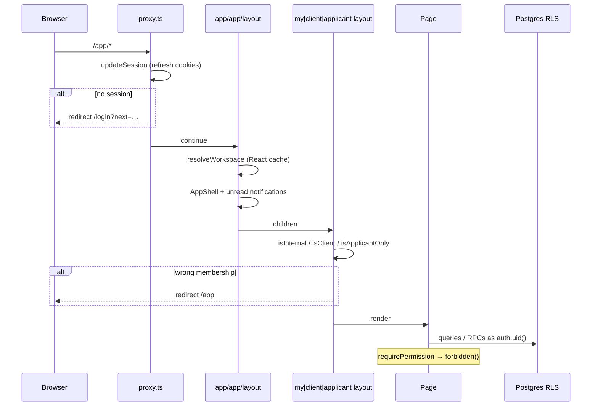

# Architecture

## Stack

| Layer | Choice |
|-------|--------|
| Framework | Next.js 16 App Router (`next@16.3.4`) |
| UI | React 19, Tailwind CSS 4, shadcn **base-nova** (`components.json`) |
| Auth / DB | Supabase Auth, Postgres, Row Level Security |
| Tests | Vitest (`tests/*.test.ts`), Playwright (`e2e/`) |
| PWA | Serwist service worker + `app/manifest.ts` |
| Push | Web Push (VAPID) via `/api/push/*` |

## Folder map

```
app/
  (marketing)/     Public site
  (auth)/          /login, /employee/login, signup, password, verify
  auth/callback/   OAuth / magic-link exchange
  app/             Authenticated workspace (+ my|client|applicant layouts)
  api/             Cron + push endpoints
components/
  app/             Shell, nav, domain forms
  ui/              shadcn primitives
  marketing/       Marketing sections
lib/
  auth/            resolveWorkspace, safeNext, landing, actions
  permissions/     can / codes
  */actions.ts     Server mutations (leave, attendance, NTE, …)
supabase/migrations/  Schema, RLS, seeds
tests/             Vitest
e2e/               Playwright
```

## Request flow



## Auth model

1. **Membership type** on `organization_memberships`: `internal` | `client` | `applicant`.
2. **Flags** (`lib/auth/workspace-flags.ts`): `isInternal`, `isClient`, `isApplicantOnly`.
3. **Permissions**: RPC `user_permission_codes()` → `Set` on workspace; UI/actions use `can()` / `requirePermission()`.
4. **Landing** (`landingPathFor`): applicant → `/app/applicant`; `system.manage` → `/app/dashboard`; else internal → `/app/my`; client → `/app/client`.
5. **Employee login** (`/employee/login`) rejects client/applicant accounts; general `/login` for those audiences.

## Data flow

| Layer | Role |
|-------|------|
| Table / view | Source of truth under RLS |
| Server action (`lib/*/actions.ts`) | Validate, mutate, optional `logAudit`, `revalidatePath` |
| Page (`app/app/**/page.tsx`) | `resolveWorkspace`, gate, query, render |

Example: leave request → `leave_requests` + `approval_requests` (workflow resolved by `code` via `lib/approvals/engine.ts`) → `/app/my/leave` and `/app/leave` revalidated.

## Deepening opportunities / product backlog (not built yet)

Documented for honesty — do not treat as shipped:

- **CMS admin** — `/app/cms` covers About (`public_about`), FAQs, services, blog, **industries**, **testimonials**, **case studies** (create + publish/archive). Public: `/about`, `/contact`, `/services`, `/resources`, `/case-studies`(+`/[slug]`). Edit-in-place for existing rows still thin.
- **Dynamic approval workflows** — `resolveActiveWorkflow` / `advanceApprovalRequest` drive leave, cash advance, and attendance corrections from `approval_workflows` + `approval_steps` (role + permission gated). Queues + `/app/approvals` hide Approve/Review when the actor cannot act on the **current** step. Admin read-only map at `/app/admin/workflows`.
- **Client SLA** — Beepa priority policies seeded; insert trigger sets `sla_due_at`; UI on tickets + client dashboard compliance. Admin policy editor not built (seed/SQL only).
- **CRM depth** — leads + deals pipeline + **proposals** (create/status) shipped; deal→client org convert shipped. **Client portal invite** shipped (`/app/clients`).
- **Google / Microsoft OAuth** — **deferred**. Email/password is the supported auth path. Provider buttons stay off (no decoys). `/auth/callback` still exchanges codes if OAuth is enabled later.
- **Ticket assignment** — staff `tickets.manage` assigns Beepa internal users via `assignTicket` on `/app/tickets/[id]`; queue shows assignee.
- **SLA policy admin** — `/app/tickets/sla` create/update Beepa priority policies (`tickets.manage`). Changes affect new tickets only.
- **Payroll approval UI** — shipped: submit + Finance→Owner review on `/app/payroll/periods/[id]`; approvals hub deep-link.
- **Email digests** — cron `notification_digest` emails unread in-app notifications via Resend when `RESEND_API_KEY` is set; users opt out with Email digests on `/app/my/notifications`.
Shipped recently (see PROJECT_STATUS): … client-org invite, **remaining CMS page types**.

See [TEST_PLAN.md](./TEST_PLAN.md) §9.