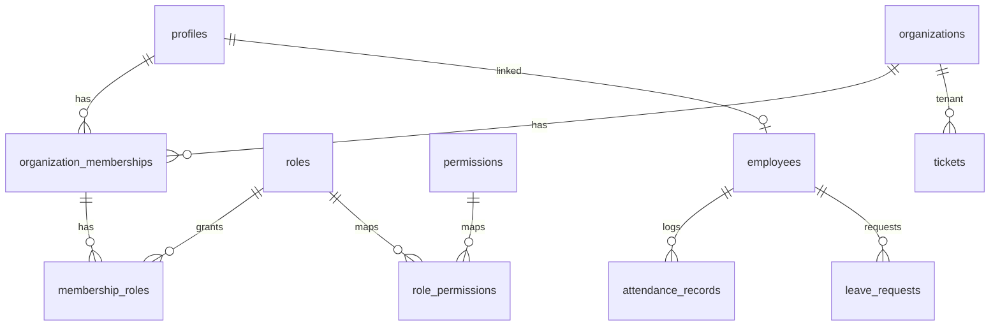

# Database overview

Supabase project: `nwvnawgxkzwiercllgmg`

## Core identity

- `profiles` — 1:1 with `auth.users` (trigger `handle_new_user`)
- `organizations` — `internal` (Beepa) or `client`
- `organization_memberships` — user ↔ org
- `roles`, `permissions`, `role_permissions`, `membership_roles`

Seeded Beepa org id: `11111111-1111-1111-1111-111111111111`

## Helpers (RLS)

- `is_internal_user()`, `is_client_member(org)`, `has_permission(code)`, `can_access_client(org)`, `is_self_employee(id)`, `user_permission_codes()`

## Domains

| Domain | Key tables |
|--------|------------|
| Workforce | `employees`, `departments`, `teams`, `employee_assignments` |
| Attendance | `attendance_policies`, `schedule_*`, `shift_assignments`, `attendance_events`, `attendance_records`, corrections, overtime |
| Leave | `leave_types`, `leave_balances`, `leave_requests` |
| Documents | `documents` + Storage buckets (`employee-documents`, `client-documents`, …); client insert policy in `20260907140000_documents_client_insert.sql` |
| Client | `client_profiles`, `client_contacts`, `client_settings` |
| Tickets | `tickets`, `ticket_messages`, `ticket_internal_notes`, SLA |
| Performance | `performance_*` |
| Billing | `billing_accounts`, `invoices`, `invoice_items`, `invoice_payments` |
| HR | `nte_*`, `cash_advance_*` |
| Payroll | `payroll_*`, `payslips`, `commission_*` |
| ATS | `job_posts`, `applicants`, `job_applications`, interviews |
| CRM | `crm_*`, `lead_attribution` |
| CMS | `services`, `industries`, `blog_posts`, … |
| Platform | `notifications`, `notification_preferences` (+ `email_digest_sent_at`), `push_subscriptions`, `audit_logs`, `approval_*` |

## ER (simplified)

## Indexes

Phase 1–2 tables have btree indexes on FKs and status filters. `20260906001300` adds:

- Covering membership lookup `(user_id, status) INCLUDE (organization_id, membership_type)`
- Partial indexes for pending leave, open tickets, open cash advances, published jobs
- Composite tickets `(client, status, created_at)` and attendance `(work_date, status)`
- `pg_trgm` GIN on profile names, job titles, ticket subjects
- Unique `employees.profile_id` where not null

`20260906001400_hardening.sql` adds:

- NTE `(employee_id, status)`, issued_by partial, responses `(nte_case_id, employee_id)`
- `application_stage_history.changed_by`, `payroll_records.payroll_period_id`
- `ticket_messages (ticket_id, created_at)`, `audit_logs (actor_user_id, created_at desc)`
- Tightened `audit_logs` insert policy: `actor_user_id = auth.uid()`

## RLS isolation

- `is_internal_user()` requires a non-applicant internal role
- Clients read assigned employees/attendance only (`is_assigned_to_current_client`)
- Clients never read payroll compensation
- Applicant memberships use `membership_type = applicant` (enum extended beyond original `internal` | `client`)
